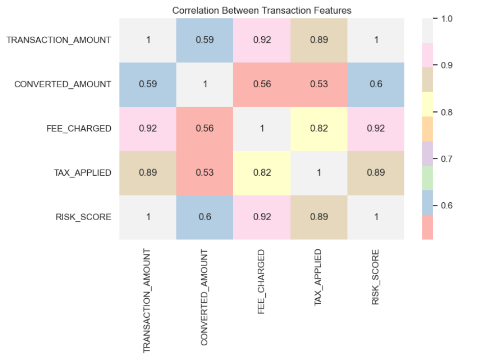

# Oracle SQL Bank Transaction Analysis

This project analyzes a bank transaction dataset using Oracle SQL and Python.  
The main goal is to explore customer behavior, transaction trends, fraud indicators, risk levels, and financial patterns through SQL queries and visualizations.

## Dataset

The dataset used in this project is a synthetic international banking transaction dataset inspired by Meezan Bank.  
It contains 15,000+ simulated cross-border transactions with information about transaction amounts, currencies, fees, taxes, processing times, fraud flags, AML indicators, risk scores, and transaction channels.

The dataset was designed for:

- Fraud detection and AML analysis
- Risk scoring and compliance analysis
- Cross-border transaction analytics
- Financial and transaction trend analysis
- Machine learning experimentation

No real customer data is included in the dataset.

Dataset Source: [Kaggle Dataset](https://www.kaggle.com/datasets/abdullahmeo/meezan-bank-international-transactions-dataset/data)

## Project Overview

In this project, Oracle SQL was used to query and analyze transaction data, while Python was used for data visualization.  
The analysis includes customer segmentation, fraud transaction patterns, monthly transaction trends, exchange rate impact, and risk-level distribution.

## Tools and Technologies

- Oracle SQL
- Oracle SQL Developer
- Python
- Pandas
- Matplotlib
- Seaborn
- Jupyter Notebook

## Analysis Sections

### 1. Monthly Transaction Overview
This section analyzes monthly transaction activity by comparing total and average transaction amounts.  
It helps identify months with higher financial activity.

### 2. Geographic Transaction Comparison
This analysis compares average transaction amounts by source and destination countries.  
It shows how transaction behavior differs across countries.

### 3. Top Customers by Transaction Activity
This section identifies the most active customers based on transaction count.  
It helps detect customers with higher transaction frequency.

### 4. Exchange Rate Impact on Converted Amounts
This analysis groups exchange rates into low, medium, and high levels.  
It shows how exchange rate levels affect converted transaction amounts.

### 5. Device Type and Processing Performance
This section compares transaction count and average processing time by device type.  
It helps understand user activity and system performance across devices.

### 6. Monthly Transaction Trend and Growth
This analysis shows cumulative transaction amount together with monthly max, min, and average values.  
It helps track financial growth and transaction changes over time.

### 7. Customer Segmentation by Spending
Customers are divided into quartiles based on their total transaction amount.  
This helps identify low, medium, and high-value customer groups.

### 8. Fraud Transaction Analysis
This section analyzes fraud-related transactions using histograms and boxplots.  
It helps observe differences between fraud and non-fraud transaction amounts.

### 9. Risk Level Distribution
Transactions are grouped into low, medium, and high risk levels based on risk score.  
This helps understand the overall risk structure of the dataset.

### 10. Largest Transaction Contribution per Customer
This analysis calculates how much each customer’s largest transaction contributes to their total spending.  
It helps detect customers whose total amount depends heavily on one large transaction.

## Sample Visualization

Below is one of the visualizations created during the analysis:

## Key Insights

- Monthly transaction amounts show changes in customer activity over time.
- Some customers have much higher transaction frequency than others.
- Risk scores help classify transactions into different risk levels.
- Fraud-related transactions can be analyzed using amount distribution and boxplots.
- Correlation analysis helps understand relationships between transaction amount, converted amount, fees, taxes, and risk score.

## Files in This Repository

- `oracle_analysis.ipynb` – Jupyter Notebook containing Oracle SQL queries and Python visualizations
- `sql/` – SQL query files
- `images/` – Screenshots of selected visualizations
- `README.md` – Project documentation

